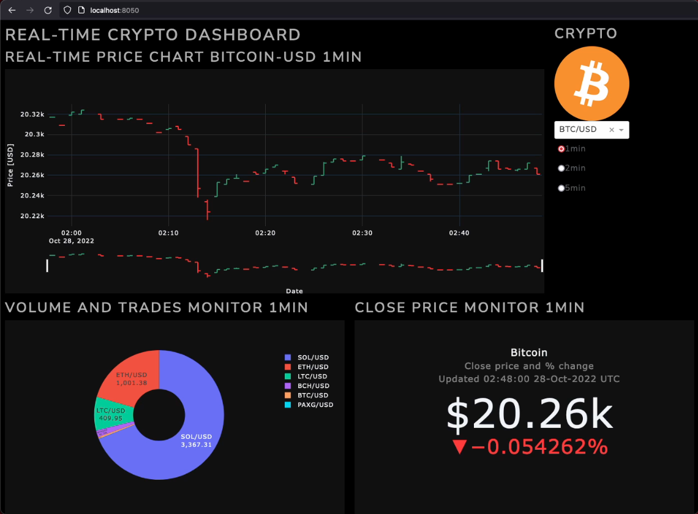
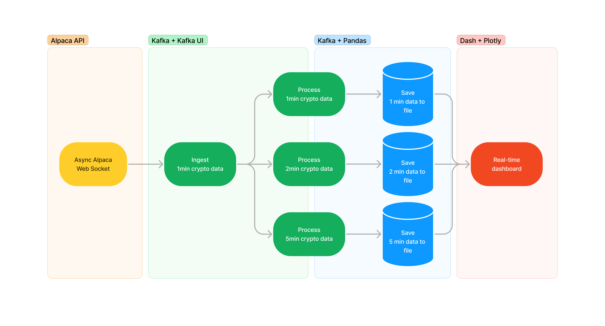
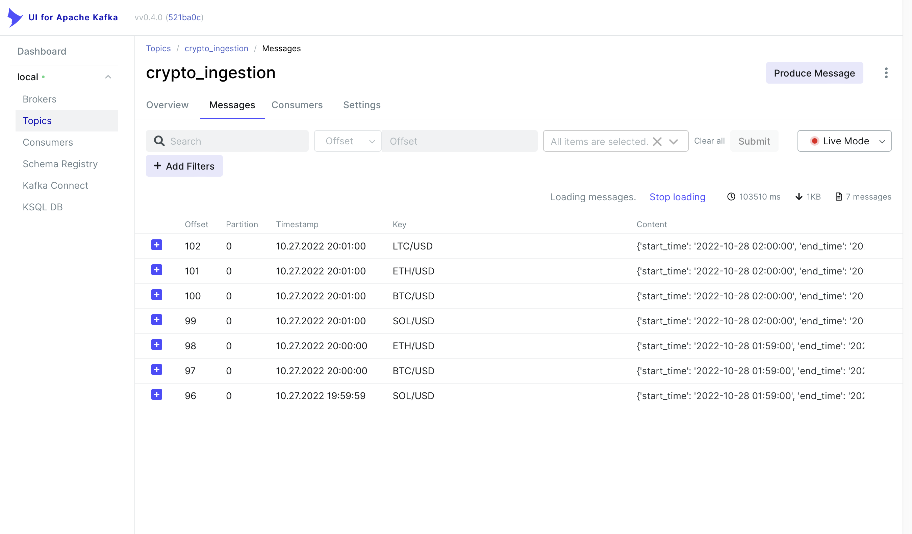

# Crypto Visualizer
This is an end-to-end application with the purpose of ingesting, processing and monitoring crypto stock data in real-time.


This development implements several technologies:
- Asyncronous web socket connections to data provider's API.
- Event streaming using Apache Kafka to transport data and communicate all the systems.
- Data engineering with Pandas.
- Web dashboard design and creation with Dash for live monitoring.

This is a complete app from proof of concept, design, implementation, testing and deployment. Although this is not meant for large scale operations, this is a fully working software.

# Prerequisites
To implement and execute this software the following were used:
- JRE [19](https://www.oracle.com/java/technologies/downloads/)
- Python v3.9
- Alpaca API [`alpaca-py v0.6.0`](https://pypi.org/project/alpaca-py/)
- Apache [`Kafka v3.3.1`](https://kafka.apache.org/)
- Python Client for Apache Kafka [`confluent-kafka v1.9.2`](https://pypi.org/project/confluent-kafka/)
- [`Kafka UI`](https://github.com/provectus/kafka-ui)
- Plotly [`plotly v5.6.0`](https://pypi.org/project/plotly/)
- Dash [`dash v2.6.2`](https://pypi.org/project/dash/)

# Workflow
The general behavior of this app is depicted as follows:


## Web Socket connection
It starts with the connection to **Alpaca API** to get pricing information in USD of the selected cryptos, in this case, `Bitcoin`, `Ethereum`, `Litecoin`, `Solana` and `Bitcoin Cash`. Then, data arrives through web socket as JSON files with price information aggregated at 1 minute resolution. Due to the behavior of the `alpaca-py` library, each ticker data looks like this:
```
data = 
	symbol='BTC/USD'
	timestamp=datetime.datetime(2027, 08, 29, 0, 0, tzinfo=datetime.timezone.utc)
	open=19594.0 
	high=19595.0 
	low=19592.0 
	close=19595.0 
	volume=0.0112 
	trade_count=4.0 
	vwap=19593.5982142857
```
so features can be accessed as follows:
```
data.high
>>> 19595.0 
```
After that, a dictionary is created and and used in next stage via a Kafka producer.

## Ingestion
To implement Kafka, both installations in the system and python libraries need to be made. Kafka system installation instructions can be found [here](https://kafka.apache.org/documentation/#quickstart); after installing it, the python client is installed using pip: `pip install confluent-kafka`.

Once those steps are covered I proceed to start Kafka zookeeper and server to enable a fully functioning Kafka environment:
```
# Open a terminal and start the ZooKeeper service
bin/zookeeper-server-start.sh config/zookeeper.properties
```
```
# Open a second terminal and start the Kafka broker service
bin/kafka-server-start.sh config/server.properties
```
### Kafka-UI
At this point, the Kafka environment is up and running, to monitor it, I implemented Kafka-UI, which is very user-friendly and suits my needs as it allows me to create and monitor topics, messages, consumer groups, among several other features. For this, I execute the following:
```
java -Dspring.config.additional-location=/path_to_kafka_ui/application-local.yml -jar /path_to/kafka-ui-api-v0.4.0.jar # this UI is accessible on localhost port 8080
```
Running UI example is shown below:

### Extra Kafka operations
Once all operations are done, I can end the environment by running in a terminal:
```
bin/kafka-server-stop.sh
```
and then:
```
bin/zookeeper-server-stop.sh
```
Additionally, I can erase data stored for my topics, messages, consumers, producers, etc. by running:
```
sudo rm -rf kafka/data/zookeeper/*
sudo rm -rf kafka/data/server/*
```
If the creation of topics, topic description and creation of consumers are to be done in a terminal I execute:
```
# create
bin/kafka-topics.sh --create --topic crypto_ingestion --bootstrap-server localhost:9092 --partitions 2

# describe
bin/kafka-topics.sh --describe --topic crypto_ingestion --bootstrap-server localhost:9092

# consumer
bin/kafka-console-consumer.sh --topic crypto_ingestion --from-beginning --bootstrap-server localhost:9092
```
When Kafka environment is running, previous step connecting to Alpaca servers can continue by creating a Kafka producer to send each minute by minute ticker concluding with this data ingestion stage (yellow block and first green block in diagram).

## Aggregation
Later, 3 Kafka consumers are created to aggregate and process data according to defined granularity, in this case, 1, 2 and 5 minutes. In the case of 1 minute no data is aggregated as it already is from Alpaca, but for 2 and 5 min, operations like max, min, first and last are performed. After this, data is saved in local csv files, one for each granularity or focus (this finishes remaining green block and blue blocks).

## Dashboard
The dashboard was designed and created using [Dash](https://dash.plotly.com/installation) and Plotly. It features live updates that automatically plot the data for all tickers and granularities which is saved in local csv files.

## Final comments
After completing the design, 8 processes in parallel are to be executed to see this project in motion as the compute process can be run with an arbitrary granularity by simply specifying it on execution:
  1. Kafka zookeeper: `bin/zookeeper-server-start.sh config/zookeeper.properties`
  2. Kafka server: `bin/kafka-server-start.sh config/server.properties`
  3. kafka UI: `java -Dspring.config.additional-location=/path_to_kafka_ui/application-local.yml -jar /path_to/kafka-ui-api-v0.4.0.jar # this UI is accessible on localhost port 8080`
  4. Ingestion and Kafka producer: `python ./processing/ingestion_process.py`
  5. 1-min processor: `python ./processing/compute_process.py 1`
  6. 2-min processor: `python ./processing/compute_process.py 2`
  7. 5-min processor: `python ./processing/compute_process.py 5`
  8. Dashboard: `python ./visualize/main.py`

Thus, for the main components, I have the following arrange for the project:
```
crypto_visualizer/
	data/
		1_min_crypto_data.csv
		2_min_crypto_data.csv
		5_min_crypto_data.csv
	processing/
		ingestion_process.py
		compute_process.py
	visualize/
		assets/
			several png icons and files.png
			app.py
			main.py
	README.md
```

## Authors

- **Alberto Avila Garcia** [- *Crypto Visualizer* -](https://github.com/BetoAvila/crypto_visualizer)
- beto0112358@gmail.com 
